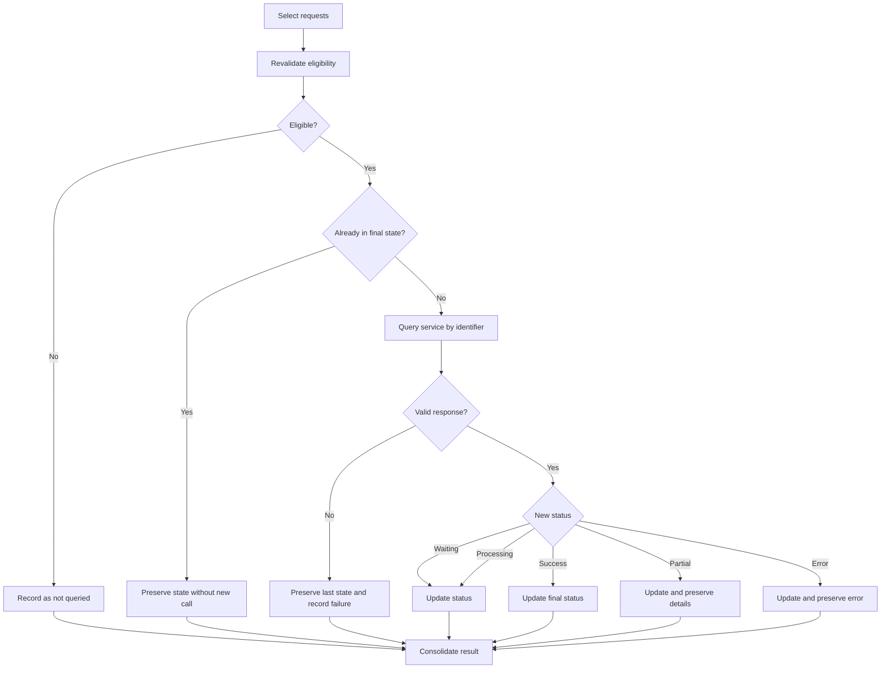

# Case Study — Asynchronous Processing Status Tracking

> **Confidentiality note:** this case is an anonymized and abstracted version of a specification developed in a real professional context. Names of systems, organizations, entities, identifiers, roles, integrations, API contracts, endpoints, routes, database structures and objects, payloads, documents, values, status codes, paths, personal data, and other technical or operational details were removed, changed, or generalized to preserve confidentiality. No code, data, contract, physical structure, or infrastructure detail from the original environment is reproduced. The requirements analysis logic, specification patterns, functional decisions, and concepts required to demonstrate the professional approach were preserved.

## 1. Problem

An application sends requests to an external platform where the initial acceptance does not mean completion. Each request receives an identifier and evolves asynchronously through multiple states. The requirement was to define how to query that evolution, persist the latest known state, preserve history, and avoid unnecessary calls after completion.

## 2. User story

**AS** a user responsible for tracking requests  
**I WANT** to query the processing status of previously submitted operations  
**SO THAT** the local state remains current and completion can be tracked with traceability.

## 3. Separation of responsibilities

| Action | Source | Purpose |
|---|---|---|
| Search | Local database | Build the list of trackable requests |
| Query processing | External service | Obtain the latest status of a request |

A local search must not trigger external calls. External processing queries should occur only through a specific action and for eligible records.

## 4. State machine

| State | Final? | Query again? |
|---|---:|---:|
| Waiting for processing | No | Yes |
| Processing | No | Yes |
| Processed successfully | Yes | No |
| Partially processed | Yes | No, except reconciliation |
| Processed with error | Yes | Not automatically |

## 5. Business rules

### BR01 — Correlation identifier required
A request may be queried only when it has a valid correlation identifier.

### BR02 — Eligibility revalidation
Before the external call, the backend must revalidate the record's state, identifier, and eligibility.

### BR03 — Non-final states remain queryable
Requests that are waiting or processing must remain available for later status checks.

### BR04 — Final states do not generate redundant calls
A completed request should not consume the external service again under normal conditions.

### BR05 — Preserve previous state on technical failure
Timeout, service unavailability, or an invalid response must not erase or replace the last confirmed state. The failed attempt must be recorded separately.

### BR06 — History represents the request, not each query
Repeated queries for the same identifier update the historical representation of that request. A new operation must not be created merely because its status was checked again.

### BR07 — Current state and history remain consistent
After a valid response, the current view and the corresponding historical record must reflect the same confirmed state.

### BR08 — Batch processing preserves individual results
When multiple requests are checked, each result must be handled independently. Failure in one request must not discard valid results from others.

### BR09 — Controlled concurrency
If the external service does not support batch queries, individual calls must respect concurrency and performance limits.

## 6. Flow

## 7. Selected acceptance criteria

- The listing must be obtained from the local database without calling the processing service.
- External queries must occur only for selected and eligible records.
- A correlation identifier is mandatory.
- The backend must revalidate eligibility before making the external call.
- Non-final states must remain queryable.
- Final states must not be queried again without a specific reason.
- Communication failure must preserve the last confirmed state.
- Updates must keep current state and history consistent.
- Querying the same identifier again must not create a new historical request.
- Batch operations must provide a consolidated summary without losing individual outcomes.

## 8. Decisions and trade-offs

**Manual/controlled polling instead of indiscriminate querying:** reduces external calls and helps respect integration limits.

**Do not overwrite state on failure:** no response does not mean a state change. This distinction prevents information regression.

**Final states as stop conditions:** makes the domain an explicit state machine and reduces unnecessary processing.

**Correlation by identifier:** preserves traceability between the original submission, later queries, and final outcome.

## 9. Skills demonstrated

- asynchronous integration;
- state-machine modeling;
- conceptual idempotency;
- request correlation;
- state and history persistence;
- batch processing;
- resilience to external failures;
- performance and concurrency requirements.
