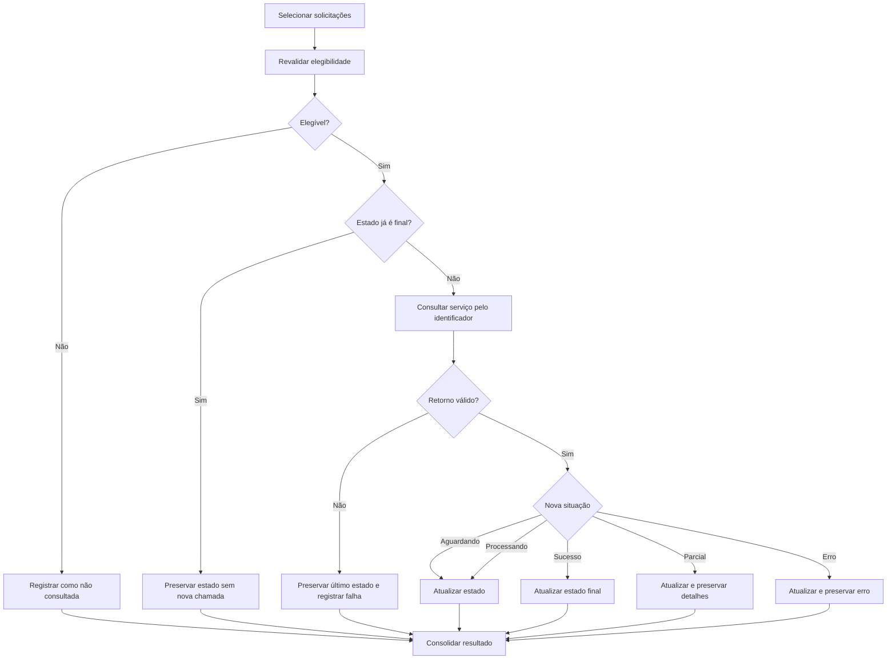

# Case Study — Acompanhamento de Processamento Assíncrono

> **Confidencialidade:** versão pública e abstraída de uma especificação elaborada em contexto profissional real. Nomes de sistemas, contratos de API, UUIDs, estruturas de banco e regras específicas do domínio foram substituídos por conceitos genéricos.

## 1. Problema

Uma aplicação envia solicitações a uma plataforma externa cujo aceite inicial não representa conclusão. Cada solicitação recebe um identificador e evolui de forma assíncrona por diferentes estados. Era necessário especificar como consultar essa evolução, persistir o último estado conhecido, preservar histórico e evitar chamadas desnecessárias depois da conclusão.

## 2. História de usuário

**COMO** usuário responsável pelo acompanhamento das solicitações  
**QUERO** consultar o processamento das operações previamente enviadas  
**PARA** manter o estado local atualizado e acompanhar sua conclusão com rastreabilidade.

## 3. Separação de responsabilidades

| Ação | Origem | Objetivo |
|---|---|---|
| Pesquisar | Base local | Montar a lista de solicitações acompanháveis |
| Consultar processamento | Serviço externo | Obter a situação mais recente de uma solicitação |

A pesquisa local não deve provocar chamadas externas. A consulta externa só deve ocorrer mediante ação específica e para registros elegíveis.

## 4. Máquina de estados

| Estado | Final? | Nova consulta? |
|---|---:|---:|
| Aguardando processamento | Não | Sim |
| Em processamento | Não | Sim |
| Processado com sucesso | Sim | Não |
| Processado parcialmente | Sim | Não, salvo reconciliação |
| Processado com erro | Sim | Não automaticamente |

## 5. Regras de negócio

### RN01 — Identificador de correlação obrigatório
Uma solicitação somente pode ser consultada quando possuir identificador de correlação válido.

### RN02 — Revalidação de elegibilidade
Antes da chamada externa, o backend deve revalidar estado, identificador e elegibilidade do registro.

### RN03 — Estados não finais permanecem consultáveis
Solicitações aguardando ou em processamento devem continuar disponíveis para consultas posteriores.

### RN04 — Estados finais não geram chamadas redundantes
Uma solicitação já finalizada não deve consumir novamente o serviço externo em condições normais.

### RN05 — Preservação do estado anterior em falha técnica
Timeout, indisponibilidade ou retorno inválido não devem apagar ou substituir o último estado confirmado. A falha da tentativa deve ser registrada separadamente.

### RN06 — Histórico representa a solicitação, não cada consulta
Consultas sucessivas sobre o mesmo identificador atualizam a representação histórica daquela solicitação. Não deve ser criada uma nova operação apenas porque seu status foi consultado novamente.

### RN07 — Estado atual e histórico devem permanecer coerentes
Após um retorno válido, a visão corrente e o registro histórico correspondente devem refletir a mesma situação confirmada.

### RN08 — Processamento em lote preserva resultado individual
Quando múltiplas solicitações forem consultadas, cada retorno deve ser tratado individualmente. Falha em uma chamada não pode apagar resultados válidos das demais.

### RN09 — Concorrência controlada
Se o serviço não oferecer consulta em lote, chamadas individuais devem respeitar limites de concorrência e performance.

## 6. Fluxo

## 7. Critérios de aceitação selecionados

- A listagem deve ser obtida da base local sem chamada ao serviço de processamento.
- A consulta externa deve ocorrer somente para registros selecionados e elegíveis.
- O identificador de correlação é obrigatório.
- O backend deve revalidar a elegibilidade antes da chamada.
- Estados não finais devem permanecer consultáveis.
- Estados finais não devem ser consultados novamente sem motivo específico.
- Falha de comunicação deve preservar o último estado confirmado.
- A atualização deve manter coerência entre estado corrente e histórico.
- Uma nova consulta do mesmo identificador não deve criar uma nova solicitação histórica.
- Operações em lote devem produzir resumo consolidado sem perder o resultado individual.

## 8. Decisões e trade-offs

**Polling manual/controlado em vez de consulta indiscriminada:** reduz chamadas externas e permite respeitar limites da integração.

**Não sobrescrever estado em falha:** ausência de resposta não equivale a mudança de estado. Essa distinção evita regressões de informação.

**Estados finais como condição de parada:** transforma o domínio em uma máquina de estados explícita e reduz processamento desnecessário.

**Correlação por identificador:** mantém rastreabilidade entre envio original, consultas posteriores e resultado final.

## 9. Competências demonstradas

- integração assíncrona;
- modelagem de máquina de estados;
- idempotência conceitual;
- correlação de solicitações;
- persistência de estado e histórico;
- processamento em lote;
- resiliência a falhas externas;
- requisitos de performance e concorrência.
