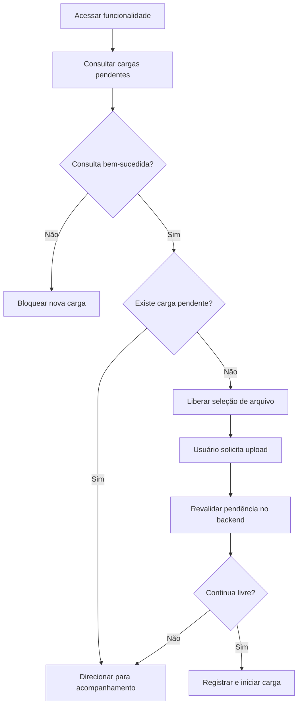

# Case Study — Controle de Concorrência em Processamento de Arquivos

> **Confidencialidade:** este case foi recriado a partir de uma necessidade profissional real. Nomes de sistema, rotas, estruturas de banco, identificadores de usuários e demais detalhes internos foram removidos ou generalizados.

## 1. Problema

Uma aplicação corporativa permitia o carregamento de arquivos para processamento em lote. Era necessário impedir que uma nova carga fosse iniciada enquanto outra permanecesse pendente, além de permitir acompanhamento do progresso e preservar o resultado individual de cada item.

O ponto crítico era evitar uma falsa sensação de segurança baseada apenas na interface: dois usuários poderiam acessar a funcionalidade em momentos próximos e tentar iniciar cargas concorrentes.

## 2. História de usuário

**COMO** usuário responsável pelo processamento de arquivos  
**QUERO** que o sistema verifique cargas pendentes antes de aceitar um novo arquivo e permita acompanhar a execução existente  
**PARA** evitar processamento simultâneo ou duplicado e manter rastreabilidade do resultado de cada item.

## 3. Regras de negócio

### RN01 — Prioridade da carga existente
Enquanto existir carga pendente ou em processamento, uma nova carga não deve ser aceita.

### RN02 — Ausência confirmada
Uma nova carga somente pode ser liberada quando o backend confirmar que não existe processamento pendente.

### RN03 — Fail closed
Se a aplicação não conseguir confirmar o estado atual por falha de consulta, o novo carregamento deve permanecer bloqueado. Uma falha técnica não pode ser interpretada como ausência de pendência.

### RN04 — Dupla validação
A situação deve ser verificada ao entrar na funcionalidade e novamente no momento efetivo do upload.

### RN05 — Validação visual não substitui validação transacional
A tela pode informar disponibilidade, mas a decisão final deve ser tomada novamente pelo backend imediatamente antes da operação.

### RN06 — Processamento independente por item
Falha em determinado item não deve interromper automaticamente os demais itens elegíveis da carga.

### RN07 — Progresso baseado em estados finais
A quantidade processada é formada pelos itens que atingiram situação final, independentemente de sucesso ou erro.

### RN08 — Conclusão da carga
Uma carga somente é concluída quando não existirem itens pendentes ou em processamento.

### RN09 — Fechamento da interface não cancela o backend
Caso a interface de acompanhamento possa ser fechada, isso não deve cancelar uma execução já iniciada.

### RN10 — Extração representa o estado atual
A exportação deve refletir o resultado individual mais recente dos itens da carga selecionada.

## 4. Fluxo de prevenção de concorrência



## 5. Acompanhamento

Durante a execução, a interface pode apresentar:

```text
Processando 37 de 120

Pendente: 74
Em processamento: 9
Sucesso: 34
Erro: 3
```

O progresso não deve depender apenas do navegador. Os quantitativos são derivados do estado persistido do processamento.

## 6. Tratamento de falhas

Uma falha individual deve:

- marcar o item com o resultado correspondente;
- preservar sua mensagem de erro quando disponível;
- permitir a continuidade dos demais itens;
- participar do total de itens concluídos;
- permanecer disponível para análise e exportação.

Uma falha ao verificar se existe processamento pendente deve ter comportamento conservador: bloquear uma nova carga até que o estado possa ser confirmado.

## 7. Critérios de aceitação selecionados

- Existindo carga pendente, novo upload deve permanecer bloqueado.
- Não existindo carga pendente, o usuário pode iniciar nova carga.
- A existência de pendência deve ser revalidada no backend no momento do upload.
- Dois usuários não devem conseguir iniciar cargas concorrentes válidas.
- Falha na consulta do estado deve bloquear o carregamento.
- O acompanhamento deve apresentar total, pendentes, sucessos e erros.
- O progresso deve ser atualizado durante a execução.
- Erro em um item não deve interromper automaticamente os demais.
- A carga termina apenas quando não houver itens pendentes ou em processamento.
- Fechar a interface, quando permitido, não deve cancelar o processamento do backend.
- A exportação deve apresentar o resultado individual de cada item da carga selecionada.

## 8. Decisões e trade-offs

**Fail closed:** em operações que podem gerar duplicidade, indisponibilidade da verificação deve resultar em bloqueio, não em liberação otimista.

**Revalidação no momento da escrita:** resolve a janela entre a consulta inicial da tela e a ação posterior do usuário.

**Processamento desacoplado da modal:** a interface acompanha a execução; ela não é a própria execução.

**Falha individual não implica falha global:** favorece processamento parcial e aumenta a capacidade de diagnóstico posterior.

## 9. Competências demonstradas

- análise de condições de corrida;
- requisitos de concorrência;
- processamento assíncrono em lote;
- fail-safe/fail-closed;
- acompanhamento de progresso;
- tolerância a falhas parciais;
- rastreabilidade por item;
- requisitos funcionais com implicações de backend.
