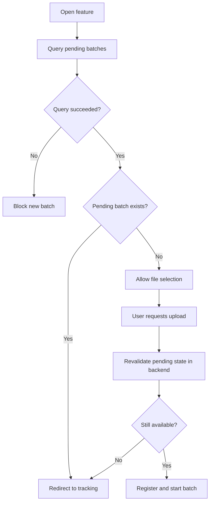

# Case Study — Concurrency Control in File Processing

> **Confidentiality note:** this case is an anonymized and abstracted version of a specification developed in a real professional context. Names of systems, organizations, entities, identifiers, roles, integrations, API contracts, endpoints, routes, database structures and objects, payloads, documents, values, status codes, paths, personal data, and other technical or operational details were removed, changed, or generalized to preserve confidentiality. No code, data, contract, physical structure, or infrastructure detail from the original environment is reproduced. The requirements analysis logic, specification patterns, functional decisions, and concepts required to demonstrate the professional approach were preserved.

## 1. Problem

A corporate application allowed files to be uploaded for batch processing. It was necessary to prevent a new batch from starting while another remained pending, while also providing progress tracking and preserving the individual outcome of each item.

The critical point was avoiding a false sense of safety based only on the interface: two users could access the feature at nearly the same time and attempt to start concurrent batches.

## 2. User story

**AS** a user responsible for file processing  
**I WANT** the system to check for pending batches before accepting a new file and allow me to track the existing execution  
**SO THAT** simultaneous or duplicate processing is prevented and each item's result remains traceable.

## 3. Business rules

### BR01 — Existing batch takes priority
While a batch is pending or processing, a new batch must not be accepted.

### BR02 — Confirmed availability
A new batch may be released only when the backend confirms that no pending processing exists.

### BR03 — Fail closed
If the application cannot confirm the current state because of a query failure, new uploads must remain blocked. A technical failure must not be interpreted as absence of pending work.

### BR04 — Double validation
The state must be checked when the feature is opened and again at the actual upload moment.

### BR05 — Visual validation does not replace transactional validation
The UI may display availability, but the final decision must be made again by the backend immediately before the operation.

### BR06 — Independent processing per item
Failure in one item must not automatically stop other eligible items in the batch.

### BR07 — Progress based on final states
The processed count is composed of items that reached a final state, regardless of success or error.

### BR08 — Batch completion
A batch is complete only when no items remain pending or processing.

### BR09 — Closing the interface does not cancel backend work
If the progress interface can be closed, doing so must not cancel an execution already started.

### BR10 — Export reflects current state
The export must represent the latest individual outcome of items in the selected batch.

## 4. Concurrency-prevention flow



## 5. Progress tracking

During execution, the interface may display:

```text
Processing 37 of 120

Pending: 74
Processing: 9
Success: 34
Error: 3
```

Progress must not depend only on the browser. Counts are derived from the persisted processing state.

## 6. Failure handling

An individual failure must:

- mark the item with the corresponding outcome;
- preserve its error message when available;
- allow the remaining items to continue;
- count as a completed item;
- remain available for analysis and export.

A failure while checking for pending processing must use conservative behavior: new uploads remain blocked until the state can be confirmed.

## 7. Selected acceptance criteria

- If a pending batch exists, new uploads must remain blocked.
- If no pending batch exists, the user may start a new batch.
- Pending state must be revalidated in the backend at upload time.
- Two users must not be able to start valid concurrent batches.
- Failure to query the current state must block the upload.
- Progress tracking must show total, pending, successful, and failed items.
- Progress values must update during execution.
- Error in one item must not automatically stop the remaining items.
- The batch completes only when no item is pending or processing.
- Closing the interface, when allowed, must not cancel backend processing.
- The export must show the individual result of each item in the selected batch.

## 8. Decisions and trade-offs

**Fail closed:** in operations where duplication is a risk, inability to verify state results in blocking instead of optimistic release.

**Revalidation at write time:** addresses the window between the initial UI check and the user's later action.

**Processing decoupled from the modal:** the interface observes the execution; it is not the execution itself.

**Individual failure does not imply global failure:** supports partial processing and improves later diagnostics.

## 9. Skills demonstrated

- race-condition analysis;
- concurrency requirements;
- asynchronous batch processing;
- fail-safe/fail-closed behavior;
- progress tracking;
- partial-failure tolerance;
- item-level traceability;
- functional requirements with backend implications.
