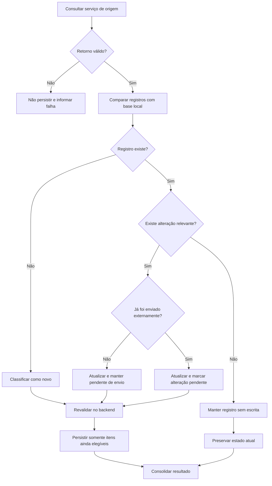

# Case Study — Sincronização de Dados com Regras de Estado e Unicidade

> **Confidencialidade:** case recriado a partir de experiência profissional real. Sistemas, integrações, entidades, identificadores, estruturas físicas e valores foram generalizados. Nenhum endpoint, tabela, payload ou dado do ambiente original é reproduzido.

## 1. Problema

Uma aplicação corporativa precisava consumir registros de um serviço de origem e manter uma base local sincronizada. O desafio não era simplesmente inserir o retorno: cada registro precisava ser classificado como novo, existente sem alteração ou existente com alteração, considerando ainda se já havia sido enviado para uma plataforma externa.

## 2. História de usuário

**COMO** usuário responsável pela gestão dos registros  
**QUERO** consultar, selecionar, gravar e atualizar os registros recebidos de um serviço de origem  
**PARA** manter a base local sincronizada e preparar corretamente cada registro para as etapas posteriores do fluxo.

## 3. Estados funcionais

A análise separou os registros em quatro situações conceituais:

| Situação | Tratamento |
|---|---|
| Novo | Inserir e disponibilizar para envio |
| Existente sem alteração | Não realizar escrita desnecessária |
| Alterado e ainda não enviado | Atualizar mantendo-o pendente de primeiro envio |
| Alterado após envio | Atualizar e marcar alteração pendente de sincronização externa |

## 4. Regras centrais

### RN01 — Identificação antes da persistência
Todo registro retornado deve ser comparado com a base local antes de qualquer inclusão ou atualização.

### RN02 — Unicidade dependente da categoria
A chave funcional pode variar conforme a categoria do registro. Em uma categoria simples, a identificação pode utilizar `ENTIDADE + REFERÊNCIA + CLASSIFICAÇÃO`; em uma categoria que admite múltiplos participantes, acrescenta-se `PARTICIPANTE` à combinação.

### RN03 — Nenhuma escrita sem mudança
Quando um registro existente não apresentar divergência relevante, não deve ocorrer INSERT, UPDATE, alteração de estado ou atualização artificial de auditoria.

### RN04 — Alteração antes do primeiro envio
Se o dado mudar antes de ter sido enviado externamente, a base local é atualizada, mas o registro continua no fluxo de primeiro envio.

### RN05 — Alteração após envio
Se o dado mudar depois de já ter sido enviado, a atualização local deve gerar um estado explícito de alteração pendente.

### RN06 — Revalidação no backend
A classificação exibida ao usuário não é suficiente para persistir. Antes da gravação, o backend deve revalidar unicidade, estado e elegibilidade, evitando decisões baseadas em informação que possa ter ficado desatualizada entre consulta e ação.

### RN07 — Processamento independente
Uma inconsistência em determinado item não deve necessariamente impedir o tratamento dos demais registros válidos do lote. O resultado deve ser consolidado por item.

### RN08 — Auditoria somente quando houver alteração
Dados de auditoria devem representar eventos reais de inclusão ou alteração, e não simples consultas ou comparações sem mudança.

## 5. Fluxo decisório

## 6. Critérios de aceitação selecionados

- Consulta deve utilizar somente os parâmetros previstos para o cenário.
- Todos os registros retornados devem ser classificados antes da montagem do resultado.
- Registros novos devem ser identificados conforme a regra de unicidade aplicável.
- Registro existente sem alteração não deve sofrer escrita nem alteração de auditoria.
- Registro alterado antes do primeiro envio deve continuar elegível para o fluxo inicial.
- Registro alterado após envio deve ser marcado para sincronização posterior.
- O backend deve revalidar o estado antes da persistência.
- Itens inválidos devem ser identificados individualmente no resultado consolidado.
- Inclusões e atualizações devem possuir rastreabilidade de data e responsável.

## 7. Decisões e trade-offs

**Evitar UPDATE desnecessário:** preserva a qualidade da auditoria e reduz escrita sem significado funcional.

**Estado local separado do estado externo:** permite distinguir claramente um registro nunca enviado de outro já sincronizado que sofreu alteração posterior.

**Unicidade por regra funcional:** a chave não é assumida apenas pela estrutura técnica; ela deriva do comportamento de cada categoria de negócio.

**Revalidação transacional:** a interface auxilia a decisão, mas o backend continua sendo a autoridade final antes da persistência.

## 8. Competências demonstradas

- modelagem de estados e transições;
- definição de regras de unicidade;
- sincronização entre fontes de dados;
- prevenção de atualizações desnecessárias;
- requisitos de auditoria;
- processamento em lote;
- tratamento de exceções;
- critérios de aceitação orientados ao comportamento do backend.
