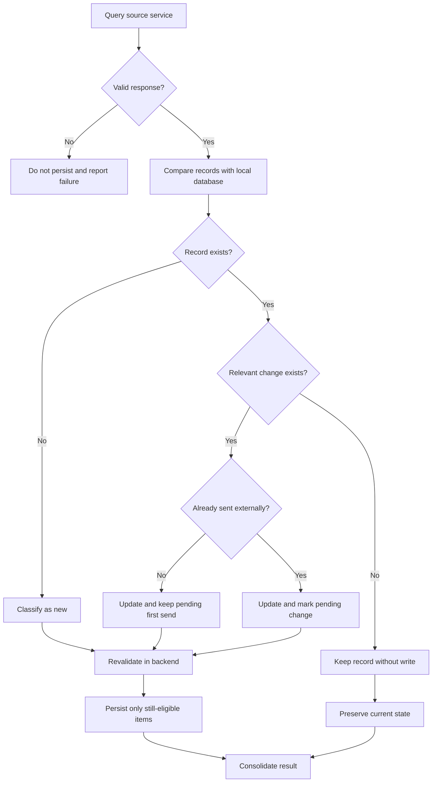

# Case Study — Data Synchronization with State and Uniqueness Rules

> **Confidentiality note:** this case is an anonymized and abstracted version of a specification developed in a real professional context. Names of systems, organizations, entities, identifiers, roles, integrations, API contracts, endpoints, routes, database structures and objects, payloads, documents, values, status codes, paths, personal data, and other technical or operational details were removed, changed, or generalized to preserve confidentiality. No code, data, contract, physical structure, or infrastructure detail from the original environment is reproduced. The requirements analysis logic, specification patterns, functional decisions, and concepts required to demonstrate the professional approach were preserved.

## 1. Problem

A corporate application needed to consume records from a source service and keep a local database synchronized. The challenge was not simply inserting the response: each record had to be classified as new, existing without changes, or existing with changes, while also considering whether it had already been sent to an external platform.

## 2. User story

**AS** a user responsible for managing the records  
**I WANT** to query, select, create, and update records received from a source service  
**SO THAT** the local database remains synchronized and each record is correctly prepared for later workflow stages.

## 3. Functional states

The analysis separated records into four conceptual situations:

| Situation | Treatment |
|---|---|
| New | Insert and make available for sending |
| Existing without changes | Avoid unnecessary writes |
| Changed and not yet sent | Update while keeping it pending for first send |
| Changed after sending | Update and mark as pending external synchronization |

## 4. Core business rules

### BR01 — Identify before persistence
Every returned record must be compared with the local database before any insert or update occurs.

### BR02 — Category-dependent uniqueness
The functional key may vary according to the record category. A simple category may use `ENTITY + REFERENCE + CLASSIFICATION`; a category that allows multiple participants adds `PARTICIPANT` to that combination.

### BR03 — No write without change
When an existing record has no relevant divergence, there must be no INSERT, UPDATE, state change, or artificial audit update.

### BR04 — Change before first send
If the data changes before being sent externally, the local record is updated but remains in the first-send workflow.

### BR05 — Change after sending
If the data changes after the record has already been sent, the local update must create an explicit pending-change state.

### BR06 — Backend revalidation
The classification displayed to the user is not sufficient for persistence. Before writing, the backend must revalidate uniqueness, state, and eligibility to avoid decisions based on stale information.

### BR07 — Independent item processing
An inconsistency in one item should not necessarily prevent valid records in the same batch from being processed. Results must be consolidated per item.

### BR08 — Audit only on actual change
Audit information must represent real insert or update events, not queries or comparisons that did not change persisted data.

## 5. Decision flow

## 6. Selected acceptance criteria

- The query must use only the parameters defined for the scenario.
- All returned records must be classified before the result is assembled.
- New records must be identified according to the applicable uniqueness rule.
- Existing unchanged records must not generate writes or audit updates.
- A record changed before first send must remain eligible for the initial flow.
- A record changed after sending must be marked for later synchronization.
- The backend must revalidate state before persistence.
- Invalid items must be individually identified in the consolidated result.
- Inserts and updates must preserve traceability of date and responsible user.

## 7. Decisions and trade-offs

**Avoid unnecessary UPDATEs:** preserves audit quality and reduces writes with no functional meaning.

**Separate local state from external state:** clearly distinguishes a record never sent from one already synchronized and later changed.

**Functional uniqueness:** the key is not assumed purely from the technical structure; it is derived from the behavior of each business category.

**Transactional revalidation:** the interface assists the decision, but the backend remains the final authority before persistence.

## 8. Skills demonstrated

- state and transition modeling;
- uniqueness-rule definition;
- synchronization across data sources;
- prevention of unnecessary updates;
- audit requirements;
- batch processing;
- exception handling;
- acceptance criteria focused on backend behavior.
