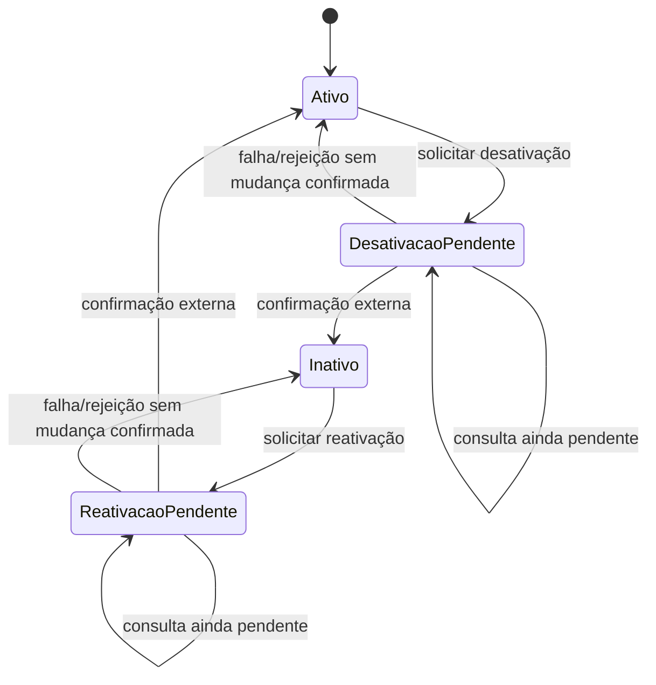

# Case Study — Ciclo de Vida de Recurso em Integração Assíncrona

> **Confidencialidade:** case recriado e fortemente abstraído a partir de uma especificação profissional. Nomes de órgãos, sistemas, APIs, tabelas, documentos, códigos de situação, payloads e identificadores foram deliberadamente removidos ou modificados.

## 1. Problema

Uma aplicação corporativa precisava controlar a ativação e desativação de um recurso mantido também em uma plataforma externa. A operação externa era assíncrona: receber HTTP de sucesso significava apenas que a solicitação havia sido aceita, e não que a mudança de estado estava concluída.

Além disso, uma das operações dependia de uma validação documental prévia, enquanto a operação inversa não possuía essa dependência. Era necessário impedir novos comandos durante processamento pendente e preservar a última situação efetivamente confirmada.

## 2. História de usuário

**COMO** usuário responsável pela gestão do recurso  
**QUERO** solicitar sua desativação ou reativação e consultar posteriormente o processamento  
**PARA** manter a situação local alinhada à plataforma externa com rastreabilidade e sem antecipar estados ainda não confirmados.

## 3. Matriz de decisão

| Estado confirmado | Pré-condição adicional | Ação disponível |
|---|---|---|
| Ativo | Evidência não validada | Nenhuma |
| Ativo | Evidência validada | Solicitar desativação |
| Inativo | Não se aplica | Solicitar reativação |
| Solicitação pendente | Não se aplica | Consultar processamento |

## 4. Regra fundamental: aceite não é conclusão

O retorno de sucesso do comando externo representa apenas **aceite para processamento**.

Portanto:

```text
HTTP de sucesso
      ↓
Solicitação aceita
      ↓
Estado = Aguardando processamento
      ↓
Consulta posterior
      ↓
Estado externo confirmado
      ↓
Atualização do estado local confirmado
```

A aplicação não deve trocar antecipadamente `Ativo` por `Inativo`, ou vice-versa, apenas porque o comando foi aceito.

## 5. Regras de negócio

### RN01 — Último estado confirmado é a referência
A interface e as ações disponíveis devem considerar a situação efetivamente confirmada mais recente, e não uma mudança ainda pendente.

### RN02 — Pré-condições assimétricas
A desativação exige evidência previamente validada. A reativação não depende dessa mesma evidência. As duas operações não devem ser tratadas como simples inversões técnicas.

### RN03 — Solicitação pendente bloqueia novo comando
Enquanto uma mudança estiver aguardando processamento, não deve ser permitido reenviar a mesma operação nem iniciar uma operação incompatível.

### RN04 — Consulta permanece disponível
Enquanto o processamento estiver pendente, o usuário pode consultar novamente a plataforma externa para obter a situação atual.

### RN05 — Falha de consulta preserva estado confirmado
Ausência do recurso no retorno, timeout, falha HTTP ou resposta sem situação não autorizam mudança do estado confirmado. A tentativa é registrada, mas o estado anterior é preservado.

### RN06 — Mudança somente após confirmação externa
A interface deve atualizar o estado operacional somente quando a consulta retornar uma situação reconhecida e conclusiva.

### RN07 — Rastreabilidade das operações
Solicitações e consultas devem produzir evidência suficiente para reconstruir o ciclo: comando enviado, aceite, identificador de correlação, consultas e estado confirmado.

### RN08 — Separação entre estado confirmado e estado da solicitação
O domínio deve distinguir `estado do recurso` de `estado do processamento da solicitação`. Um recurso pode continuar confirmado como ativo enquanto uma solicitação de desativação está pendente.

## 6. Modelo conceitual de estados



## 7. Tratamento de retorno

**Comando aceito:** registrar a solicitação como pendente e disponibilizar consulta posterior.

**Consulta confirma novo estado:** registrar a confirmação e atualizar a interface.

**Consulta informa que o estado ainda não mudou:** manter processamento pendente quando aplicável.

**Falha técnica ou retorno inconclusivo:** registrar a tentativa e preservar o último estado confirmado.

## 8. Critérios de aceitação selecionados

- Recurso ativo sem pré-condição válida não deve permitir desativação.
- Recurso ativo com pré-condição válida deve permitir solicitação de desativação.
- Recurso inativo deve permitir reativação sem exigir a mesma pré-condição documental.
- O aceite da solicitação não deve alterar antecipadamente o estado confirmado.
- Enquanto houver processamento pendente, novo comando deve permanecer bloqueado.
- Deve existir ação específica para consultar o processamento pendente.
- Uma consulta inconclusiva deve preservar o último estado confirmado.
- Somente situação conclusiva reconhecida deve atualizar o estado operacional.
- Solicitações e consultas devem manter rastreabilidade suficiente para auditoria.

## 9. Decisões e trade-offs

**Dois estados em vez de um:** separar situação do recurso e situação da solicitação elimina ambiguidades comuns em integrações assíncronas.

**Consulta manual/controlada:** evita polling automático agressivo quando não há requisito que justifique consumo contínuo do serviço externo.

**Estado confirmado prevalece sobre intenção:** o sistema registra que existe uma mudança solicitada, mas não apresenta essa intenção como fato consumado.

**Pré-condições por operação:** regras de negócio são modeladas explicitamente para cada transição, evitando assumir simetria onde ela não existe.

## 10. Competências demonstradas

- modelagem de ciclo de vida;
- integrações assíncronas;
- máquina de estados;
- matriz de decisão;
- tratamento de pré-condições;
- correlação e auditoria;
- prevenção de comandos duplicados;
- tratamento de timeout e respostas inconclusivas;
- separação entre intenção, processamento e estado confirmado.
