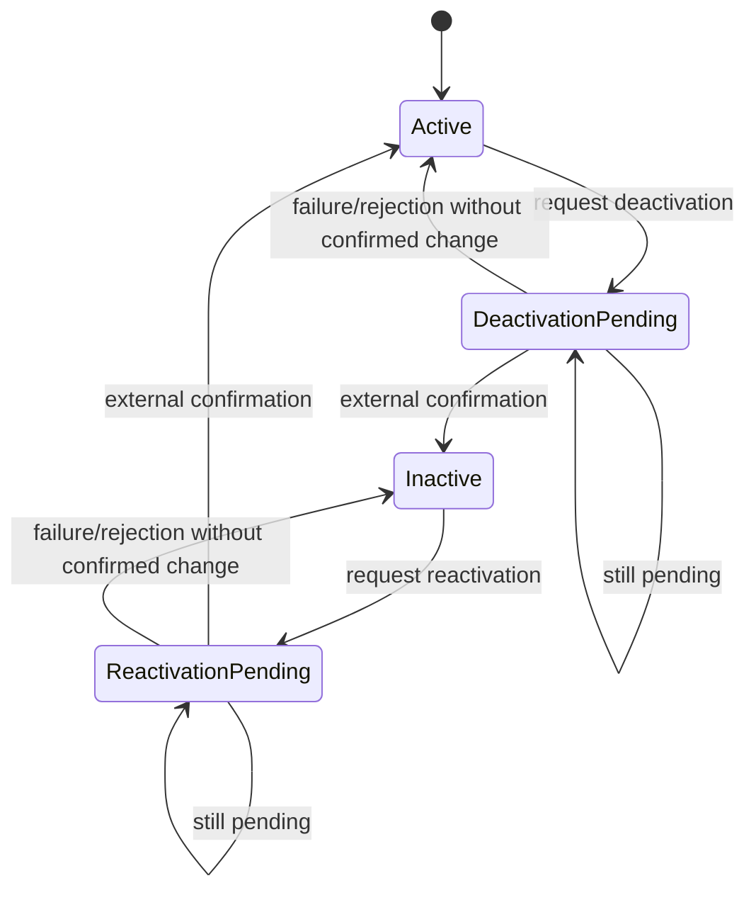

# Case Study — External Resource Lifecycle in an Asynchronous Integration

> **Confidentiality note:** this case is an anonymized and abstracted version of a specification developed in a real professional context. Names of systems, organizations, entities, identifiers, roles, integrations, API contracts, endpoints, routes, database structures and objects, payloads, documents, values, status codes, paths, personal data, and other technical or operational details were removed, changed, or generalized to preserve confidentiality. No code, data, contract, physical structure, or infrastructure detail from the original environment is reproduced. The requirements analysis logic, specification patterns, functional decisions, and concepts required to demonstrate the professional approach were preserved.

## 1. Problem

A corporate application needed to control activation and deactivation of a resource also maintained in an external platform. The external operation was asynchronous: receiving a successful HTTP response meant only that the request had been accepted, not that the state change had been completed.

In addition, one operation depended on prior evidence validation while the reverse operation did not. New commands had to be blocked while processing was pending, and the latest actually confirmed state had to be preserved.

## 2. User story

**AS** a user responsible for managing the resource  
**I WANT** to request its deactivation or reactivation and later query the processing result  
**SO THAT** the local state remains aligned with the external platform, with traceability and without anticipating unconfirmed states.

## 3. Decision matrix

| Confirmed state | Additional precondition | Available action |
|---|---|---|
| Active | Evidence not validated | None |
| Active | Evidence validated | Request deactivation |
| Inactive | Not applicable | Request reactivation |
| Request pending | Not applicable | Query processing |

## 4. Fundamental rule: acceptance is not completion

A successful command response represents only **acceptance for processing**.

```text
Successful HTTP response
      ↓
Request accepted
      ↓
State = Waiting for processing
      ↓
Later query
      ↓
External state confirmed
      ↓
Update confirmed local state
```

The application must not prematurely change `Active` to `Inactive`, or vice versa, merely because the command was accepted.

## 5. Business rules

### BR01 — Latest confirmed state is the reference
The interface and available actions must use the latest actually confirmed state rather than a change that is still pending.

### BR02 — Asymmetric preconditions
Deactivation requires previously validated evidence. Reactivation does not depend on that same evidence. The two operations must not be treated as simple technical inverses.

### BR03 — Pending request blocks new commands
While a state change is waiting for processing, the same operation must not be resent and incompatible operations must not be started.

### BR04 — Query remains available
While processing is pending, the user may query the external platform again for the current state.

### BR05 — Query failure preserves confirmed state
Missing resource in the response, timeout, HTTP failure, or response without a valid status must not change the confirmed state. The attempt is recorded while the previous state is preserved.

### BR06 — Change only after external confirmation
The interface must update the operational state only when the query returns a recognized and conclusive state.

### BR07 — Operation traceability
Requests and queries must provide enough evidence to reconstruct the lifecycle: command sent, acceptance, correlation identifier, later queries, and confirmed state.

### BR08 — Separate confirmed resource state from request state
The domain must distinguish `resource state` from `request processing state`. A resource can remain confirmed as active while a deactivation request is pending.

## 6. Conceptual state model



## 7. Response handling

**Command accepted:** record the request as pending and make a later query available.

**Query confirms new state:** record the confirmation and update the interface.

**Query shows the state has not changed yet:** keep processing pending when applicable.

**Technical failure or inconclusive response:** record the attempt and preserve the last confirmed state.

## 8. Selected acceptance criteria

- An active resource without a valid precondition must not allow deactivation.
- An active resource with a valid precondition must allow a deactivation request.
- An inactive resource must allow reactivation without requiring the same documentary precondition.
- Request acceptance must not prematurely change the confirmed state.
- While processing is pending, new commands must remain blocked.
- A specific action must exist to query pending processing.
- An inconclusive query must preserve the last confirmed state.
- Only a recognized conclusive state may update the operational state.
- Requests and queries must maintain enough traceability for audit purposes.

## 9. Decisions and trade-offs

**Two states instead of one:** separating resource state from request state removes ambiguity common in asynchronous integrations.

**Manual/controlled queries:** avoids aggressive automatic polling when continuous service consumption is not justified by the requirement.

**Confirmed state takes precedence over intent:** the system records that a change was requested, but does not present that intention as a completed fact.

**Operation-specific preconditions:** business rules are explicitly modeled for each transition instead of assuming symmetry where none exists.

## 10. Skills demonstrated

- lifecycle modeling;
- asynchronous integrations;
- state machines;
- decision matrices;
- precondition handling;
- correlation and auditing;
- duplicate-command prevention;
- timeout and inconclusive-response handling;
- separation of intent, processing, and confirmed state.
