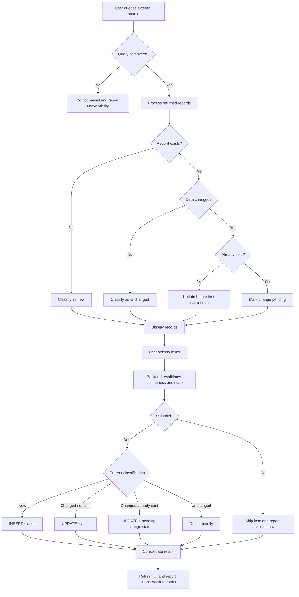

# Case Study — Requirements Engineering for a Stateful Synchronization Workflow

> **Confidentiality note:** this case study is an anonymized and abstracted version of a specification produced in a real professional context. System names, organizations, entities, identifiers, profiles, integrations, API contracts, endpoints, routes, database structures and objects, payloads, documents, values, status codes, paths, personal data, and other technical or operational details have been removed, changed, or generalized to preserve confidentiality. No code, data, contract, physical structure, or infrastructure detail from the original environment is reproduced. The requirements analysis logic, specification patterns, functional decisions, and concepts needed to demonstrate the professional approach have been preserved.

## 1. Overview

This case study demonstrates how an operational need was transformed into an implementable functional specification for a synchronization workflow between an external source and a local database.

The challenge was not simply to "fetch data and save it." The solution needed to distinguish new records, existing records with no changes, existing records with changes, records already sent to another system, and records not yet sent. Each combination required different behavior.

The specification also needed to cover UI behavior, backend validation, persistence, auditability, integration boundaries, exception handling, batch processing, revalidation, and acceptance criteria.

The focus of this case is not the original business domain, but the **Requirements Engineering method applied to a stateful, integrated workflow**.

## 2. Business problem

The application needed to periodically query an external source, compare its response with the local database, and decide what to do with each record.

The expected behavior depended mainly on two dimensions:

```text
1. Does the record already exist locally?
2. If it exists, has its content or state changed?
```

A third dimension changed the treatment significantly:

```text
Has the record already been sent to the destination system?
```

This combination of states cannot be handled safely by a simplistic `INSERT OR UPDATE` strategy.

## 3. My responsibility

My role was to transform the functional need into a specification detailed enough for development, testing, and homologation.

This included:

- defining the objective, scope, and boundaries of the story;
- identifying preconditions and postconditions;
- separating responsibilities related to querying, persistence, and integration;
- defining uniqueness rules;
- modeling the possible business states;
- defining behavior for new, unchanged, and changed records;
- defining different behavior for records not yet sent and records already sent;
- specifying audit requirements;
- detailing individual and batch selection;
- defining backend revalidation;
- defining messages and exception handling;
- translating rules into verifiable acceptance criteria;
- decomposing the larger workflow into smaller stories when a single story would span too many responsibilities.

## 4. Decomposing the problem

One of the first requirements decisions was to avoid an oversized story.

The complete workflow had different responsibilities:

```text
Query source
      ↓
Compare with local database
      ↓
Insert / update locally
      ↓
Send to external system
      ↓
Check external processing
      ↓
Validate result
      ↓
Send future changes
```

Instead of mixing all of these concerns, the process was decomposed into independent stages.

This case focuses on:

```text
External source
      ↓
Comparison
      ↓
Local persistence
      ↓
Classification of the next state
```

This decomposition reduces functional coupling and supports incremental development, testing, and validation.

## 5. Explicit scope definition

A mature requirement must state both **what is included** and **what is not included**.

### In scope

- query records from the external source;
- apply the operation's defined filters;
- identify new records;
- identify existing records with no changes;
- identify existing records with changes;
- support individual and batch selection;
- insert new records;
- update eligible records;
- update control states;
- record audit information;
- present a consolidated result to the user;
- handle unavailability and inconsistencies.

### Out of scope

- actual submission to the destination system;
- external processing consultation;
- final validation in the destination system;
- sending subsequent changes through integration;
- building integration-specific payloads for later stages.

This boundary prevents one user story from becoming an entire distributed workflow that cannot be validated independently.

## 6. Preconditions and postconditions

The specification defined the minimum valid state before execution:

```text
Authenticated user
      +
Required permission
      +
Available functionality
      +
Required filter provided
      +
External source available
      +
Local persistence structure ready
```

It also defined the expected postconditions:

```text
New record
    → persisted locally
    → available for the next stage

Changed record not yet sent
    → updated locally
    → remains pending initial submission

Changed record already sent
    → updated locally
    → marked as pending change

Unchanged record
    → remains untouched
```

Postconditions turn a UI action into a verifiable business-state transition.

## 7. Context-dependent uniqueness

One of the most important refinements was recognizing that the functional key was not necessarily the same for every category.

For some categories, conceptual identity could be represented as:

```text
Entity + Business Reference + Financial Category
```

For another category, an additional responsible actor was required:

```text
Entity + Business Reference + Financial Category + Responsible Actor
```

In generic form:

```text
Category A/B/C
UNIQUE = entity_id + business_reference + financial_category

Category D
UNIQUE = entity_id + business_reference + financial_category + responsible_actor
```

This distinction prevents false duplicates and avoids merging records that are functionally different.

## 8. Record classification

Each record returned by the external source needed to be compared with local state before persistence.

The conceptual classification was:

```text
External record
      ↓
Exists locally?
  ┌──────┴──────┐
  NO            YES
  │              │
 NEW        Content changed?
             ┌────┴────┐
            NO         YES
             │          │
       UNCHANGED     check submission state
```

This step transforms raw data into **functional states**.

## 9. Functional state machine

The most important behavior depended on the combination of change status and submission status.

```text
                         ┌───────────────────┐
                         │       NEW         │
                         └─────────┬─────────┘
                                   │ persist
                                   ▼
                         ┌───────────────────┐
                         │ PENDING SUBMISSION│
                         └─────────┬─────────┘
                                   │ future send
                                   ▼
                         ┌───────────────────┐
                         │       SENT        │
                         └─────────┬─────────┘
                                   │ source changes
                                   ▼
                         ┌───────────────────┐
                         │  CHANGE PENDING   │
                         └───────────────────┘
```

For a record not yet sent, a content change does not need to be classified as a pending external change. The local value can simply be updated before the first submission.

For a record that has already been sent, the same content change means something different: the local state now diverges from what was previously transmitted.

That distinction is central to the specification.

## 10. Decision matrix

The rule was translated into a decision matrix to remove ambiguity:

| Record exists? | Data changed? | Already sent? | Action |
|---|---|---|---|
| No | — | — | Insert and classify as pending submission |
| Yes | No | No/Yes | Do not update |
| Yes | Yes | No | Update and keep pending initial submission |
| Yes | Yes | Yes | Update and mark change pending |

The matrix reduces inconsistent interpretations across business, development, and QA.

## 11. Doing nothing is also a rule

An important detail was explicitly specifying that unchanged records **must not be updated**.

That means:

```text
If nothing changed:
- do not insert;
- do not update data;
- do not change state;
- do not change audit fields;
```

This avoids unnecessary writes and prevents audit fields from suggesting a functional change that never happened.

## 12. Backend revalidation

The classification shown to the user could not be considered authoritative until persistence time.

Between the initial query and the user's confirmation, the database state could change.

The specification therefore required backend revalidation:

```text
Query
   ↓
Preliminary classification
   ↓
User selects records
   ↓
User confirms persistence
   ↓
BACKEND REVALIDATES
   ↓
State still valid?
 ┌─────┴─────┐
 NO          YES
  │           │
skip /      persist
report
```

This reduces the risk of functional race conditions and decisions based on stale UI state.

## 13. Per-item processing inside a batch

Batch selection should not turn all selected records into one indivisible decision.

The expected behavior was modeled so that each item is processed according to its own conditions.

Conceptually:

```text
Selected batch
      ↓
Item 1 → valid → success
Item 2 → state changed → skipped
Item 3 → valid → success
Item 4 → functional error → failed
      ↓
Consolidated result
```

This allows the user to receive meaningful totals for processed, skipped, and failed items without necessarily losing the entire batch because of one record.

## 14. Auditability as a functional requirement

Audit behavior was not treated only as a database implementation detail.

The specification distinguished:

```text
Insert
- creation timestamp
- creator identity

Real update
- last-change timestamp
- modifier identity

No change
- do not modify audit data
```

This ensures the audit trail represents actual business events rather than mere executions of the feature.

## 15. External-source unavailability

The external query had an important fail-safe functional rule:

```text
Source unavailable
      ↓
Do not persist partial assumptions
      ↓
Inform unavailability
```

The application must not interpret a failed source query as an empty business result.

This prevents an integration failure from becoming an incorrect business decision.

## 16. Consolidated functional flow



## 17. Acceptance criteria as a verifiable contract

Instead of generic statements such as "the feature must work correctly," the original specification defined observable behavior.

Anonymized examples:

### AC — New record

**Given** a record returned by the source does not exist locally according to the functional key,  
**when** the user confirms persistence,  
**then** the system must create the record, classify it as pending submission, and populate creation-audit information.

### AC — Existing record with no change

**Given** the record already exists and relevant data remains unchanged,  
**when** comparison is performed,  
**then** the system must not update data, state, or audit fields.

### AC — Changed record not yet sent

**Given** the record exists, its content changed, and it has not yet been sent,  
**when** persistence is confirmed,  
**then** the system must update the data, record audit information, and keep the record in the initial-submission flow.

### AC — Changed record after submission

**Given** the record has already been sent and the source now provides changed data,  
**when** the update is confirmed,  
**then** the system must update the local database and classify the record as having a pending change for later processing.

### AC — State changed during operation

**Given** a record was classified during the initial query,  
**and** its state changes before confirmation,  
**when** the backend revalidates the operation,  
**then** the item must not be processed using the stale state.

## 18. Why this is more than a synchronization case

The technical problem could be summarized as "synchronize records." Requirements Engineering work exists to prevent that vague sentence from reaching the implementation team unchanged.

The specification translated a broad intention into explicit decisions about:

```text
identity
+ state
+ transition
+ persistence
+ auditability
+ integration
+ concurrency
+ user experience
+ exceptions
+ verifiable criteria
```

That level of refinement reduces implicit implementation decisions and improves traceability from business need through development and validation.

## 19. Artifacts produced during refinement

For this type of workflow, the main requirements artifacts include:

- user story;
- purpose and scope;
- preconditions and postconditions;
- decision matrix;
- uniqueness rules;
- state-transition rules;
- functional flow;
- conceptual data mapping;
- acceptance criteria;
- success and error messages;
- exception scenarios;
- validation/homologation points;
- dependencies with preceding and subsequent stories.

## 20. Skills demonstrated

- Requirements Engineering;
- Product Ownership;
- Business Analysis;
- functional specification;
- user-story refinement;
- scope definition;
- decomposition of complex features;
- business-rule modeling;
- state-machine reasoning;
- decision-table design;
- functional data modeling;
- uniqueness and identity rules;
- integration requirements;
- backend validation requirements;
- concurrency/race-condition awareness;
- audit requirements;
- batch-processing behavior;
- exception handling;
- acceptance-criteria design;
- QA/homologation readiness;
- communication between business and engineering.

## 21. Lessons learned

This case reinforces several principles I apply when refining complex features:

1. **A user story should not only describe what the user wants; it should remove enough ambiguity to make implementation and testing reliable.**
2. **Previous state matters as much as current data.**
3. **Uniqueness is a business rule, not merely a technical constraint.**
4. **"Do nothing" must also be specified when it is the correct behavior.**
5. **The UI is not the final authority: critical operations should be revalidated in the backend.**
6. **Acceptance criteria must be observable and verifiable.**
7. **Clear scope prevents one story from becoming several coupled integrations.**
8. **Audit data should represent real business changes, not just technical execution.**

## 22. Authorship and transparency

This case study was reconstructed from a real professional specification authored by me during functional refinement work.

The public version does not reproduce system names, URLs, physical database structures, table or column names, identifiers, payloads, personal data, real status codes, or integration contracts.

What has been preserved is the Requirements Engineering logic: problem decomposition, business-rule identification, state modeling, scope definition, exception handling, and the construction of acceptance criteria that are implementable and testable.
