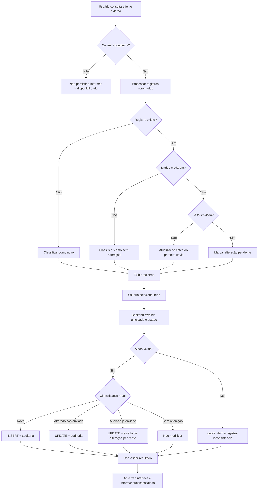

# Case Study — Requirements Engineering para um Fluxo de Sincronização com Estados

> **Nota de confidencialidade:** este case é uma versão anonimizada e abstraída de uma especificação elaborada em contexto profissional real. Nomes de sistemas, órgãos, entidades, identificadores, perfis, integrações, contratos de API, endpoints, rotas, estruturas e objetos de banco de dados, payloads, documentos, valores, códigos de situação, caminhos, dados pessoais e demais detalhes técnicos ou operacionais foram removidos, alterados ou generalizados para preservar a confidencialidade. Nenhum código, dado, contrato, estrutura física ou detalhe de infraestrutura do ambiente original é reproduzido. A lógica de análise de requisitos, os padrões de especificação, as decisões funcionais e os conceitos necessários para demonstrar a abordagem profissional foram preservados.

## 1. Visão geral

Este case demonstra como uma necessidade operacional foi transformada em uma especificação funcional implementável para um fluxo de sincronização entre uma fonte externa e uma base local.

O desafio não era apenas "buscar dados e gravar". A solução precisava distinguir registros novos, existentes sem alteração, existentes com alteração, registros já enviados para outro sistema e registros ainda não enviados. Cada combinação exigia um comportamento diferente.

A especificação também precisava cobrir interface, backend, persistência, auditoria, integração, tratamento de exceções, processamento em lote, revalidação e critérios de aceite.

O foco deste case não é o domínio original, mas o **método de Requirements Engineering aplicado a um fluxo stateful e integrado**.

## 2. Problema de negócio

A aplicação precisava consultar periodicamente uma fonte externa, comparar o retorno com a base local e decidir o que fazer com cada registro.

O comportamento esperado dependia de duas dimensões principais:

```text
1. O registro já existe localmente?
2. Se existe, seu conteúdo ou estado mudou?
```

Além disso, uma terceira dimensão alterava completamente o tratamento:

```text
O registro já foi enviado para o sistema de destino?
```

Isso cria uma combinação de estados que não pode ser tratada com um simples `INSERT OR UPDATE`.

## 3. Minha responsabilidade

Minha atuação foi transformar a necessidade funcional em uma especificação suficientemente detalhada para desenvolvimento, teste e homologação.

Isso incluiu:

- definir objetivo, escopo e fronteiras da história;
- identificar pré-condições e pós-condições;
- separar o que pertence à consulta, persistência e integração;
- definir regras de unicidade;
- modelar os diferentes estados possíveis;
- definir comportamento para registros novos, inalterados e alterados;
- definir diferenças entre registros ainda não enviados e registros já enviados;
- especificar auditoria;
- detalhar seleção individual e em lote;
- definir revalidação no backend;
- definir mensagens e tratamento de exceção;
- traduzir as regras em critérios de aceitação verificáveis;
- decompor o fluxo em histórias menores quando a funcionalidade ultrapassava uma única responsabilidade.

## 4. Decomposição do problema

Uma das primeiras decisões de requisitos foi evitar uma história excessivamente ampla.

O fluxo completo possuía responsabilidades diferentes:

```text
Consultar origem
      ↓
Comparar com base local
      ↓
Gravar / atualizar localmente
      ↓
Enviar para sistema externo
      ↓
Consultar processamento externo
      ↓
Validar resultado
      ↓
Enviar alterações futuras
```

Em vez de misturar todas essas responsabilidades, o processo foi decomposto em etapas independentes.

O case apresentado aqui concentra-se na etapa:

```text
Origem externa
      ↓
Comparação
      ↓
Persistência local
      ↓
Classificação do próximo estado
```

Essa decomposição reduz acoplamento funcional e facilita desenvolvimento, testes e homologação incremental.

## 5. Definição explícita de escopo

Um requisito maduro precisa dizer tanto **o que será feito** quanto **o que não será feito**.

### Dentro do escopo

- consultar os registros da fonte externa;
- aplicar os filtros definidos para a operação;
- identificar registros novos;
- identificar registros existentes sem alteração;
- identificar registros existentes com alteração;
- permitir seleção individual e em lote;
- inserir novos registros;
- atualizar registros elegíveis;
- atualizar estados de controle;
- registrar auditoria;
- apresentar resultado consolidado ao usuário;
- tratar indisponibilidade e inconsistências.

### Fora do escopo

- envio efetivo ao sistema de destino;
- consulta do processamento externo;
- validação final no sistema de destino;
- envio de alterações por integração;
- montagem de payloads específicos da integração subsequente.

Essa fronteira impede que uma única história se transforme em um fluxo distribuído impossível de validar de forma isolada.

## 6. Pré-condições e pós-condições

A especificação definiu o estado mínimo necessário antes da execução:

```text
Usuário autenticado
      +
Permissão adequada
      +
Funcionalidade disponível
      +
Filtro obrigatório preenchido
      +
Fonte externa disponível
      +
Estrutura local preparada
```

Também definiu as condições que deveriam ser verdadeiras ao final:

```text
Novo registro
    → gravado localmente
    → disponível para próxima etapa

Registro alterado e ainda não enviado
    → atualizado localmente
    → continua aguardando envio inicial

Registro alterado e já enviado
    → atualizado localmente
    → marcado como alteração pendente

Registro sem alteração
    → permanece intacto
```

A pós-condição é importante porque transforma uma ação de tela em uma mudança de estado de negócio verificável.

## 7. Regra de unicidade dependente do contexto

Um dos pontos mais importantes do refinamento foi perceber que a chave funcional não era necessariamente igual para todas as categorias do domínio.

Para um conjunto de categorias, a identidade conceitual podia ser representada por:

```text
Entidade + Referência + Categoria Financeira
```

Para outra categoria, havia necessidade de acrescentar um ator adicional:

```text
Entidade + Referência + Categoria Financeira + Responsável
```

Em formato genérico:

```text
Categoria A/B/C
UNIQUE = entity_id + business_reference + financial_category

Categoria D
UNIQUE = entity_id + business_reference + financial_category + responsible_actor
```

Essa distinção evita falsos duplicados e também evita consolidar registros que são funcionalmente diferentes.

## 8. Classificação dos registros

Cada registro retornado pela fonte externa precisava ser comparado com o estado local antes de qualquer gravação.

A classificação conceitual ficou assim:

```text
Registro externo
      ↓
Existe localmente?
  ┌──────┴──────┐
 NÃO            SIM
  │              │
 NOVO       Conteúdo mudou?
             ┌────┴────┐
            NÃO       SIM
             │          │
       SEM ALTERAÇÃO   verificar estado de envio
```

Essa etapa transforma dados brutos em **estados funcionais**.

## 9. Máquina de estados funcional

O comportamento mais importante estava na combinação entre alteração e estado de envio.

```text
                         ┌───────────────────┐
                         │      NOVO         │
                         └─────────┬─────────┘
                                   │ gravar
                                   ▼
                         ┌───────────────────┐
                         │ AGUARDANDO ENVIO  │
                         └─────────┬─────────┘
                                   │ envio futuro
                                   ▼
                         ┌───────────────────┐
                         │     ENVIADO       │
                         └─────────┬─────────┘
                                   │ fonte externa muda
                                   ▼
                         ┌───────────────────┐
                         │ALTERAÇÃO PENDENTE │
                         └───────────────────┘
```

Para um registro ainda não enviado, uma mudança de conteúdo não precisa ser tratada como "alteração externa pendente". Basta atualizar o dado que ainda será enviado pela primeira vez.

Para um registro já enviado, a mesma mudança de conteúdo significa outra coisa: existe uma divergência entre o estado local atualizado e aquilo que já foi transmitido anteriormente.

Essa diferença é central na especificação.

## 10. Matriz de decisão

A regra foi traduzida para uma matriz para remover ambiguidades:

| Registro existe? | Dados mudaram? | Já enviado? | Ação |
|---|---|---|---|
| Não | — | — | Inserir e classificar como aguardando envio |
| Sim | Não | Não/Sim | Não atualizar |
| Sim | Sim | Não | Atualizar e manter aguardando envio inicial |
| Sim | Sim | Sim | Atualizar e marcar alteração pendente |

A matriz reduz interpretações diferentes entre negócio, desenvolvimento e QA.

## 11. Não atualizar também é uma regra

Um detalhe importante foi explicitar que registros sem alteração **não deveriam sofrer UPDATE**.

Isso significa:

```text
Se nada mudou:
- não inserir;
- não atualizar dado;
- não alterar estado;
- não alterar auditoria;
```

Essa regra evita escrita desnecessária e impede que campos de auditoria transmitam uma falsa impressão de modificação funcional.

## 12. Revalidação no backend

A classificação exibida ao usuário não podia ser tratada como garantia absoluta até o momento da gravação.

Entre a consulta e o clique de confirmação, o estado da base poderia mudar.

Por isso, a especificação exigiu revalidação no backend:

```text
Consulta
   ↓
Classificação preliminar
   ↓
Usuário seleciona registros
   ↓
Confirma gravação
   ↓
BACKEND REVALIDA
   ↓
estado continua válido?
 ┌─────┴─────┐
 NÃO        SIM
  │           │
ignorar /    persistir
reportar
```

Isso reduz risco de race condition funcional e decisões baseadas em estado obsoleto da tela.

## 13. Processamento individual dentro do lote

A seleção em lote não deveria transformar todos os registros em uma única decisão indivisível.

O comportamento esperado foi modelado para processar cada item segundo suas próprias condições.

Conceitualmente:

```text
Lote selecionado
      ↓
Item 1 → válido → sucesso
Item 2 → estado mudou → ignorado
Item 3 → válido → sucesso
Item 4 → erro funcional → falha
      ↓
Resultado consolidado
```

Isso permite informar ao usuário quantos itens foram processados, ignorados ou falharam sem necessariamente perder todo o lote por causa de um único registro.

## 14. Auditoria como requisito funcional

Auditoria não foi tratada apenas como detalhe técnico do banco.

A especificação diferenciou:

```text
Inclusão
- data de criação
- responsável pela criação

Alteração real
- data da última alteração
- responsável pela alteração

Sem alteração
- não modificar auditoria
```

Essa regra garante que o histórico represente eventos de negócio reais e não apenas execuções da funcionalidade.

## 15. Tratamento de indisponibilidade da integração

A consulta à origem externa possuía uma regra importante de segurança funcional:

```text
Fonte indisponível
      ↓
Não persistir dados parciais
      ↓
Informar indisponibilidade
```

A aplicação não deveria inferir ausência de registros quando, na verdade, a fonte estava indisponível.

Essa distinção evita transformar uma falha de integração em uma decisão de negócio incorreta.

## 16. Fluxo funcional consolidado



## 17. Critérios de aceite como contrato verificável

Em vez de utilizar critérios genéricos como "deve funcionar corretamente", a especificação que originou este case detalhava comportamentos verificáveis.

Exemplos anonimizados:

### CA — Registro novo

**Dado** que um registro retornado pela origem não existe localmente segundo a chave funcional,  
**quando** o usuário confirmar a gravação,  
**então** o sistema deverá criar o registro, classificá-lo como aguardando envio e preencher os dados de auditoria de inclusão.

### CA — Registro existente sem alteração

**Dado** que o registro já existe e os dados relevantes permanecem iguais,  
**quando** a comparação for executada,  
**então** o sistema não deverá atualizar dados, estados nem auditoria.

### CA — Registro alterado ainda não enviado

**Dado** que o registro existe, houve alteração e ele ainda não foi enviado,  
**quando** a gravação for confirmada,  
**então** o sistema deverá atualizar os dados, registrar auditoria e mantê-lo no fluxo de envio inicial.

### CA — Registro alterado após envio

**Dado** que o registro já foi enviado e a origem apresenta uma alteração,  
**quando** a atualização for confirmada,  
**então** o sistema deverá atualizar a base local e classificá-lo como alteração pendente para tratamento posterior.

### CA — Estado alterado durante a operação

**Dado** que um registro foi classificado na consulta,  
**e** que seu estado mudou antes da confirmação,  
**quando** o backend revalidar a operação,  
**então** o item não deverá ser processado com base no estado antigo.

## 18. Por que este não é apenas um case de sincronização

O problema técnico poderia ser resumido como "sincronizar registros". O trabalho de Requirements Engineering foi justamente impedir que essa frase vaga chegasse à equipe de desenvolvimento.

A especificação transformou uma intenção ampla em decisões concretas sobre:

```text
identidade
+ estado
+ transição
+ persistência
+ auditoria
+ integração
+ concorrência
+ experiência do usuário
+ exceções
+ critérios verificáveis
```

Esse nível de refinamento reduz decisões implícitas durante a implementação e melhora a rastreabilidade entre necessidade de negócio, desenvolvimento e homologação.

## 19. Artefatos produzidos no processo de refinamento

Em um fluxo desse tipo, os principais artefatos de requisitos incluem:

- história de usuário;
- propósito e escopo;
- pré-condições e pós-condições;
- matriz de decisão;
- regras de unicidade;
- regras de transição de estado;
- fluxo funcional;
- mapeamento conceitual de dados;
- critérios de aceitação;
- mensagens de erro e sucesso;
- exceções;
- pontos de homologação;
- dependências com histórias anteriores e posteriores.

## 20. Competências demonstradas

- Requirements Engineering;
- Product Ownership;
- Business Analysis;
- functional specification;
- user-story refinement;
- scope definition;
- decomposition of complex features;
- business-rule modeling;
- state-machine reasoning;
- decision-table design;
- functional data modeling;
- uniqueness and identity rules;
- integration requirements;
- backend validation requirements;
- concurrency/race-condition awareness;
- audit requirements;
- batch-processing behavior;
- exception handling;
- acceptance-criteria design;
- QA/homologation readiness;
- communication between business and engineering.

## 21. Aprendizados

Este case reforça alguns princípios que utilizo no refinamento de funcionalidades complexas:

1. **Uma história não deve apenas dizer o que o usuário quer; deve remover ambiguidades suficientes para permitir implementação e teste.**
2. **Estados anteriores importam tanto quanto o dado atual.**
3. **Unicidade é uma regra de negócio, não apenas uma constraint técnica.**
4. **"Não fazer nada" também precisa ser especificado quando é o comportamento correto.**
5. **A tela não é a autoridade final: operações críticas devem ser revalidadas no backend.**
6. **Critérios de aceite precisam ser observáveis e verificáveis.**
7. **Escopo bem definido evita transformar uma história em várias integrações acopladas.**
8. **Auditoria deve refletir alterações reais de negócio, e não apenas execuções técnicas.**

## 22. Autoria e transparência

Este case foi reconstruído a partir de uma especificação profissional real elaborada por mim em contexto de refinamento funcional.

A versão pública não reproduz nomes de sistemas, URLs, estruturas físicas, nomes de tabelas ou colunas, identificadores, payloads, dados pessoais, códigos reais de situação ou contratos de integração.

O que foi preservado é a lógica de Requirements Engineering: decomposição do problema, identificação das regras, modelagem dos estados, definição de escopo, tratamento de exceções e construção de critérios de aceitação implementáveis e testáveis.
